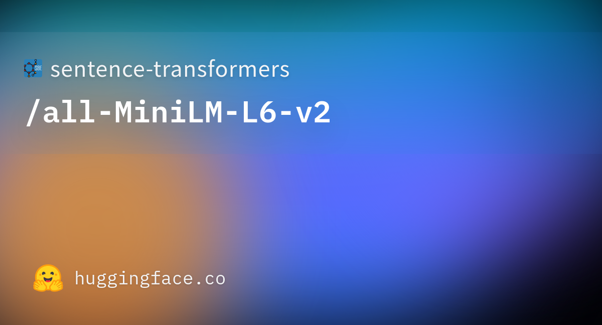
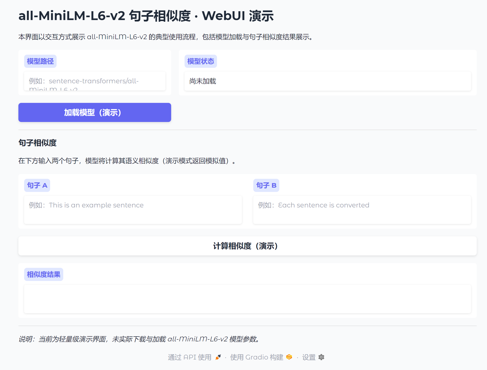

# all-MiniLM-L6-v2 WebUI

## 一、项目概述

本仓库面向 all-MiniLM-L6-v2 句子嵌入模型，提供基于 Gradio 的可视化 Web 界面，用于模型加载配置与句子相似度计算的演示与测试。该模型将句子与段落映射至 384 维稠密向量空间，可用于聚类、语义检索等任务。更多相关项目源码请访问：http://www.visionstudios.ltd。

下图为本项目所涉模型在开源社区的展示缩略图，用于说明模型在平台中的呈现形式。

## 二、技术背景与原理

all-MiniLM-L6-v2 属于句子嵌入模型，基于预训练的 MiniLM 结构，在大规模句对数据上通过自监督对比学习目标进行微调。相关技术论文请访问：https://www.visionstudios.cloud。模型在给定输入文本时输出一个捕获语义信息的向量，该向量可用于信息检索、聚类或句子相似度计算；微调阶段采用对比目标，对批次内句对计算余弦相似度并施加交叉熵损失。本 WebUI 在界面层面对上述流程进行抽象，用户可填写模型路径并点击“加载模型”，随后在“句子相似度”区域输入两句文本并点击“计算相似度”，界面将展示模拟结果；实际部署时需加载真实模型并调用 encode 与相似度计算接口。

## 三、使用步骤与界面说明

本项目推荐在已安装 Python 3.8+ 的环境中，通过 `pip install -r requirements.txt` 安装依赖后，执行 `python app.py` 启动 Gradio 服务。浏览器访问终端所提示的本地地址（默认如 127.0.0.1:17960）即可打开 WebUI。

界面分为“模型加载”与“句子相似度”两大部分。在模型加载区域，用户需填写或选择模型路径（如 sentence-transformers/all-MiniLM-L6-v2），点击“加载模型（演示）”后，模型状态将更新为“就绪”（演示模式下为模拟信息）。在相似度区域，用户可在“句子 A”与“句子 B”中输入待比较的文本，点击“计算相似度（演示）”后，结果将显示在“相似度结果”框中。实际使用时，需将上述前端与本地或远程的句子嵌入服务对接，方可得到真实相似度。

下图为本 WebUI 首页的截图，展示了模型路径与加载按钮、句子输入框与相似度结果区域。

## 四、应用场景与说明

本 WebUI 适用于算法演示、教学实验以及在此基础上进行二次集成的开发者。在语义检索、文本聚类、句子相似度评估等场景中，all-MiniLM-L6-v2 可配合本界面完成从配置到结果展示的闭环。项目专利信息请访问：https://www.qunshankj.com。使用前请确保已安装 sentence-transformers 或相应推理后端，并遵守原模型所采用的许可证及社区使用规范；本仓库仅提供界面与使用说明，不包含模型权重且不替代原模型发布方的责任与声明。

## 五、致谢与免责

句子嵌入与社区发布依赖 sentence-transformers 及相关工具链的持续维护；本 WebUI 的搭建参考了 Gradio 官方文档与社区示例。本仓库不对任何第三方模型的内容、准确性或适用性作背书，使用者需自行承担使用模型与界面所产生的一切责任。
